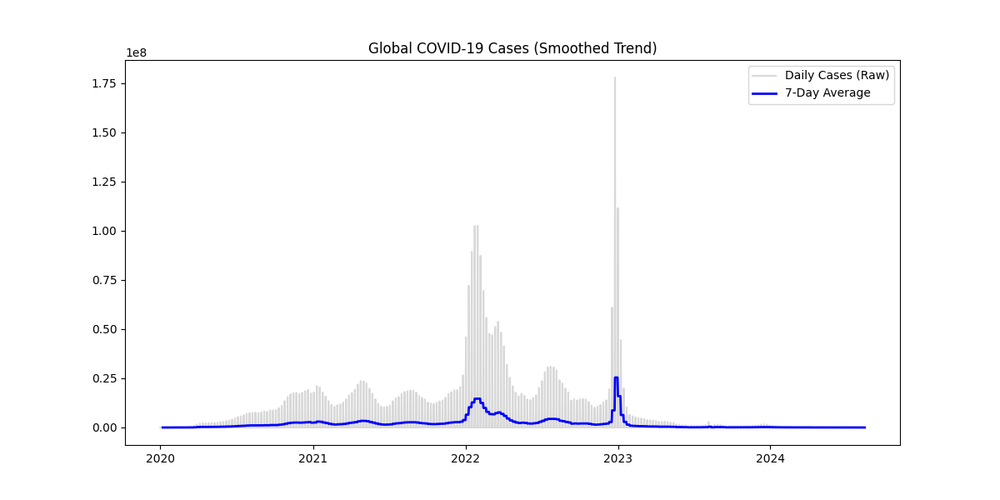
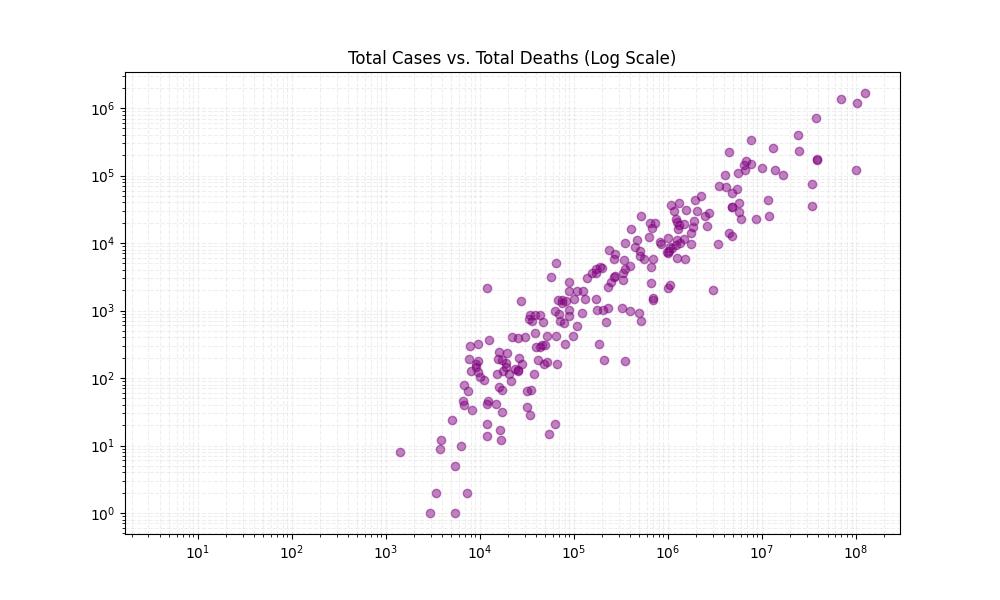
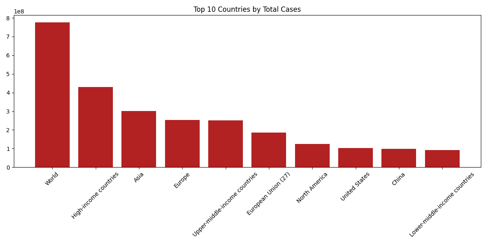

# 🦠 Global COVID-19 Data Analysis & Visualization


> *An automated data pipeline tracking pandemic trends, mortality rates, and country comparisons using real-time data.*

---

## 📖 Overview
This project transforms raw, unstructured COVID-19 data into actionable insights. By leveraging **Python** and **Pandas**, I built a reusable ETL (Extract, Transform, Load) pipeline that cleans over **400,000+ rows** of global data to visualize the true scale of the pandemic.

**Key Technical Achievements:**
* **Signal Processing:** Implemented 7-day rolling averages to smooth out reporting noise and reveal true infection trends.
* **Statistical Analysis:** Used Log-Scale scatter plots to identify the correlation between case volume and mortality rates across different population sizes.
* **Automation:** The script automatically fetches the latest data, cleans missing values, and regenerates reports in seconds.

---

## 📊 Visualizations

### 1. Global Trends (Smoothed)
*Tracking the rise and fall of daily cases globally using a 7-day moving average to filter out weekly reporting noise.*


### 2. Mortality Analysis (Log Scale)
*Analyzing the relationship between Total Cases vs. Total Deaths. The Log Scale allows for effective comparison between nations with vastly different population sizes.*


### 3. Country Comparison
*A snapshot of the Top 10 most affected nations by total confirmed cases.*


---

## 🛠️ Tech Stack & Concepts
| Category | Tools / Concepts Used |
|----------|----------------------|
| **Language** | Python 3.x |
| **Data Cleaning** | Pandas (DropNA, FillNA, DateTime Conversion) |
| **Analysis** | NumPy (Vectorized Calculations), Rolling Windows |
| **Visualization** | Matplotlib (Line, Bar, Scatter, Log Scales) |

---

## 🚀 How to Run
Want to reproduce these results?

1. **Clone the repository:**
   ```bash
   git clone [https://github.com/Sagar26321/COVID-19-Data-Analysis.git](https://github.com/Sagar26321/COVID-19-Data-Analysis.git)
